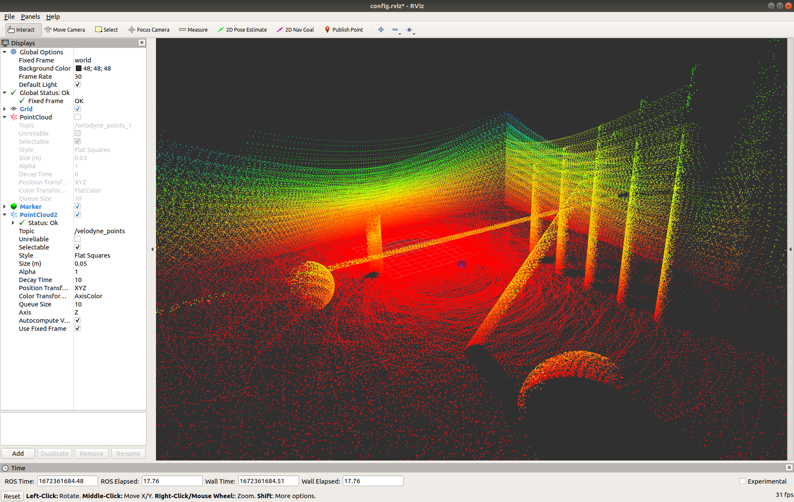

# lidar_sim

Simulation of a LiDAR based on geometric primitives. Below an example for the Velodyne VLP16 configuration.



## Set it up
```bash
mkdir ~/simulation_ws/src
cd ~/simulation_ws/src
git clone git@github.com:adrianomcr/lidar_sim.git
cd ~/simulation_ws
catkin build  --cmake-args -DCMAKE_BUILD_TYPE=Release
source devel/setup.bash
```

OBS: The `Release` argument is important to make the code run (way) faster.


## Use it
```bash
cd ~/simulation_ws
source devel/setup.bash
roslaunch lidar_sim example.launch
```

## About the software


### Available geometric primitives

- Plane
- Sphere
- Cylinder


## Contact

Adriano Rezende

adrianomcr18@gmail.com