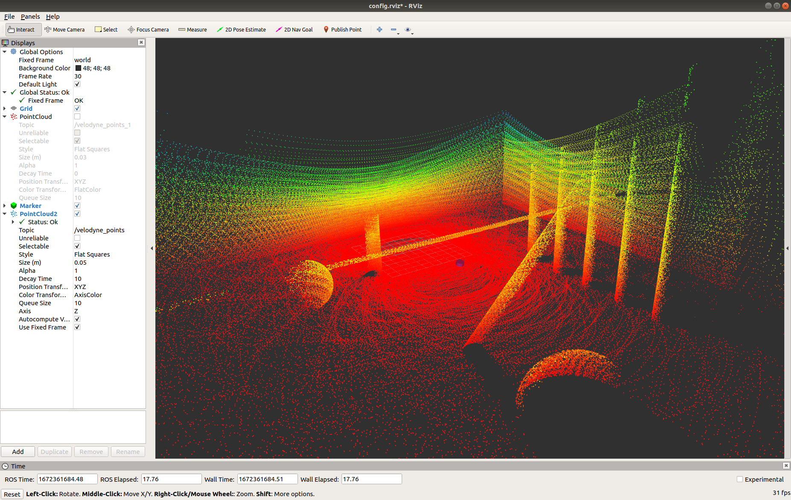

# lidar_sim

Simulation of a LiDAR based on geometric primitives. Below an example for the Velodyne VLP16 configuration.



## Docker setup
Clone the repo and the submodules
```bash
mkdir ~/simulation_ws/src
cd ~/simulation_ws/src
git clone git@github.com:adrianomcr/lidar_sim.git
cd lidar_sim
git submodule update --depth 1 --init --recursive 
```

Build the image
```bash
docker compose -f docker-compose.yaml build
```

Give docker access to the X server
```bash
xhost +local:docker
```

Run the docker container
```bash
docker compose -f docker-compose.yaml run --rm sim4cd bash
```


## Native setup
```bash
mkdir ~/simulation_ws/src
cd ~/simulation_ws/src
git clone git@github.com:adrianomcr/lidar_sim.git --recursive
cd lidar_sim
git submodule update --init
cd ~/simulation_ws
catkin build  --cmake-args -DCMAKE_BUILD_TYPE=Release
source devel/setup.bash
```


## Use it
```bash
roslaunch lidar_sim example.launch
```

## About the software

Each object in the scene is composed of one basif geometric shape (geometric primitives). Its is also possible to use a constraint to "cut" of part of the geometric primitive.


### Available geometric primitives

- Plane
- Sphere
- Cylinder
- Ellipsoid

### Available constraints

- Plane

## Contact

Adriano Rezende

adrianomcr18@gmail.com